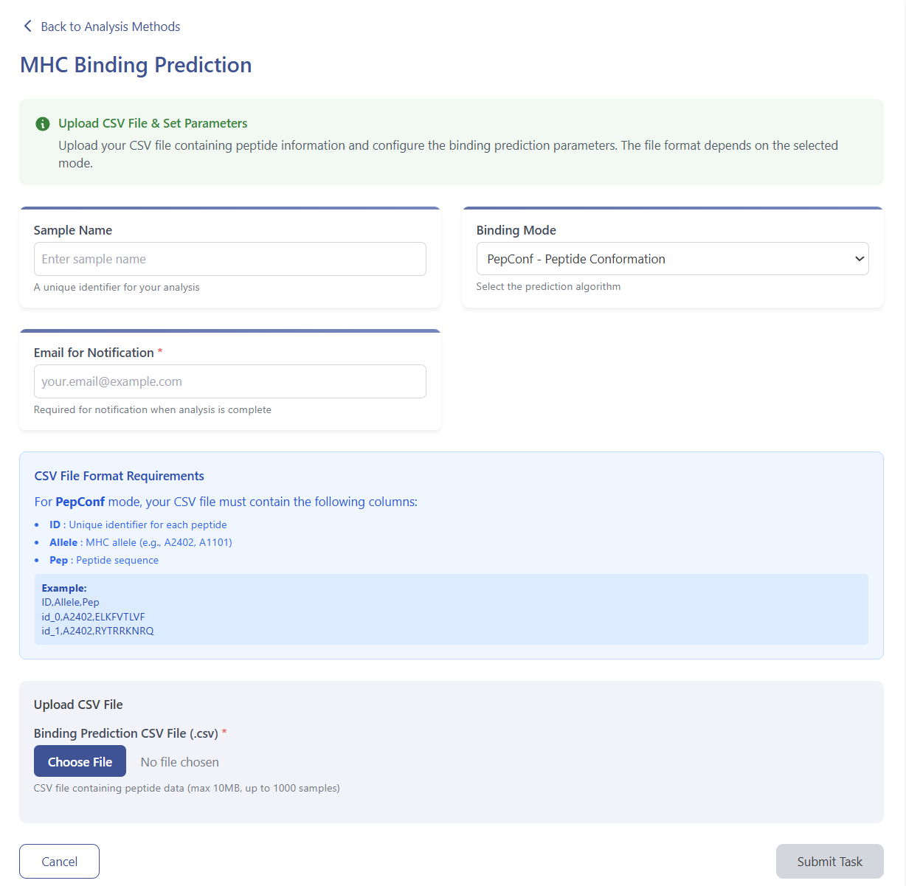

# Predicting Neoantigen Binding Module

The accurate prediction of immunogenic neoantigens is pivotal for advancing personalized cancer immunotherapy. Neoantigen binding prediction integrates peptide sequences, HLA type information, and structural data of HLA-I molecules to reconstruct peptide–HLA conformations and estimate binding affinity and foreignness. EAMHC’s module offers two complementary modes plus five state-of-the-art affinity predictors.

## Integrated Prediction Tools

- **netMHCpan-4.1**  
  A pan-specific neural network that predicts peptide–MHC class I binding using both sequence and peptide-MHC pseudo-sequence features.  

- **MHCflurry-2.0**  
  An ensemble of machine-learning models trained on eluted ligand and binding affinity data to predict peptide–MHC class I presentation.  

- **DeepHLAPan-v1.1**  
  A deep convolutional network that integrates peptide sequence, HLA pseudo-sequence, and structural features for binding prediction.  

- **NeoaPred-1.0.0**  
  An integrated pipeline combining binding affinity, stability, and processing predictors to score neoantigen immunogenicity.  

- **HLAthena**  
  A mass-spectrometry-trained model optimized for both common and rare HLA alleles, focusing on antigen presentation likelihood.

In addition, EAMHC implements two custom structural modes:

- **PepConf**  
  • Builds a 3D peptide–HLA-I conformation using the HLA-I crystal structure and peptide sequence  
  • Computes a 2D distance matrix between peptide and HLA atoms  
  • Enforces spatial constraints via an intermolecular loss function  

- **PepFore**  
  • Compares mutant vs. wild-type peptide surface electrostatics, spatial geometry, and atomic composition  
  • Computes a “foreignness” score indicating potential immunogenicity  

---

## Workflow Steps

### 1. Launch Module  
Click **Predicting Neoantigen Binding** → **Start**.  

  

### 2. Upload Data & Select Mode  
- Enter sample/task metadata (Sample ID, Project Name).  
- Select prediction mode: **PepConf** or **PepFore**.  
- Optionally choose which of the five predictors to run or run all.  

  

  
- View example inputs & reports at:  
  https://eamhc.deepomics.org/database  

  

  
- On submission, you’ll receive email updates (start, progress, completion/failure).

### 3. Query Job Status  
Visit **Workspace**:  
https://eamhc.deepomics.org/workspace  
Search by registered email.  

  

### 4. Download Results  
- **Predicted pHLA-I Conformation** (interactive 3D)  
  

    
  
  
- **Affinity Prediction Summary** from netMHCpan, MHCflurry, DeepHLAPan, HLAthena  
  

    
  
  
- **Full Results** (scores, conformations, per-tool reports)  
  

    
  

---

## References

1. Reynisson B., Alvarez B., Paul S., Peters B., Nielsen M. NetMHCpan-4.1 and NetMHCIIpan-4.0: improved predictions of peptide–MHC interactions. *Immunogenetics* 2020;72(7–8):725–731.  
2. O’Donnell T.J., Rubinsteyn A., Bonsack M., et al. MHCflurry-2.0: improved pan-allele prediction of peptide–MHC binding and presentation. *Cell Syst.* 2021;12(6):536–551.e15.  
3. Wu J., Zhan C., Liu G., et al. DeepHLAPan: deep learning-based pan-specific prediction of HLA-peptide binding. *Bioinformatics* 2022;38(12):3203–3212.  
4. Rezende M.I.B., Carvalho A.M., Pinto L.F.R., et al. NeoaPred: an integrated pipeline for neoantigen prediction. *Genome Med.* 2023;15:22.  
5. Sarkizova S., Klaeger S., Le P.M., et al. HLAthena: mass spectrometry-optimized HLA class I antigen prediction for rare and common alleles. *Genome Med.* 2020;12(1):53.  
6. Zhou F., Cao H., Zuo X., et al. Deep sequencing of the MHC region in the Chinese population contributes to studies of complex disease. *Nat. Genet.* 2016;48(7):740–746. https://doi.org/10.1038/ng.3576