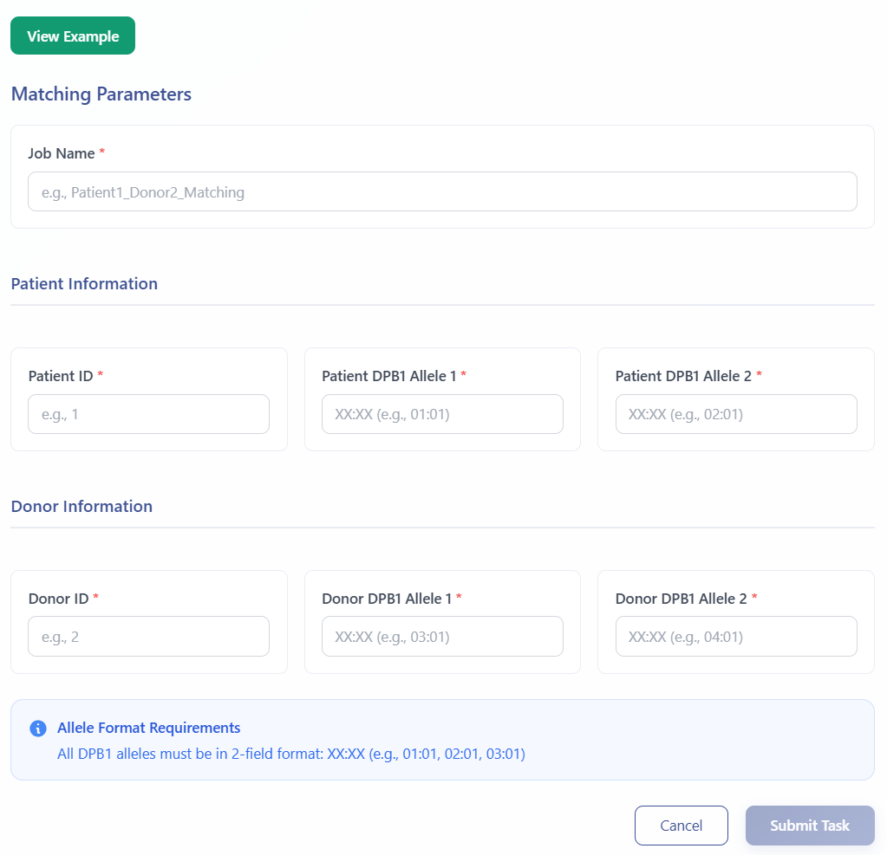
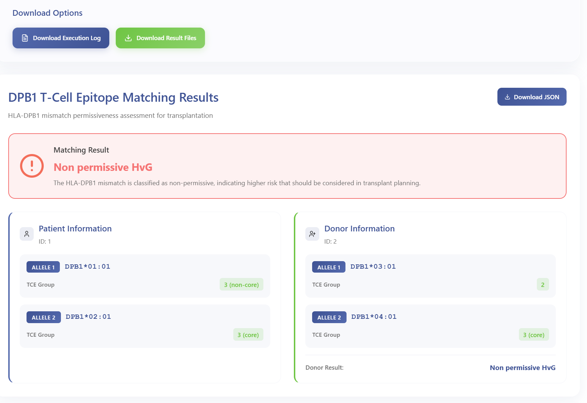

# DPB1 T-Cell Epitope Matching Module

The DPB1 T-Cell Epitope Matching module evaluates HLA-DPB1 mismatch permissiveness for hematopoietic stem cell transplantation based on T-cell epitope (TCE) group classification. The algorithm distinguishes permissive from non-permissive donor-recipient pairs, supporting clinical decision-making in unrelated donor selection to minimize graft-versus-host disease risk. This tool implements the latest TCE matching algorithm (Version 3) as recommended by international transplantation guidelines.

---

## Workflow Steps

### 1. Launch DPB1 TCE Matching Module  
Click **DPB1 T-Cell Epitope Matching** in the analysis menu to access the module.

### 2. Enter HLA-DPB1 Typing Information

- Enter sample/task metadata (Sample ID, Project Name)
- Input **Patient HLA-DPB1 alleles** (required): Both alleles for the recipient
- Input **Donor HLA-DPB1 alleles** (required): Both alleles for the donor
- Click the green **View Example** button to access sample data and example results

  

Upon submission, you will receive a **temporary link** and a **Task ID** that can be used to query job status and retrieve results.

### 3. Query Job Status  
Visit **Workspace**:  
https://eamhc.deepomics.org/workspace  
Search by your Task ID or use the temporary link to view job status and results.

### 4. Download Results  
- **TCE group assignments** and **permissiveness classification**  
  

    
  

---

## References

1. Crivello P., Zito L., Sizzano F., et al. The impact of HLA-DPB1 T-cell epitope matching on clinical outcomes after unrelated hematopoietic stem cell transplantation. *Haematologica* 2016;101(8):1004–1011.
2. Fleischhauer K., Shaw B.E. HLA-DP in unrelated hematopoietic cell transplantation revisited: challenges and opportunities. *Blood* 2017;130(9):1089–1096.