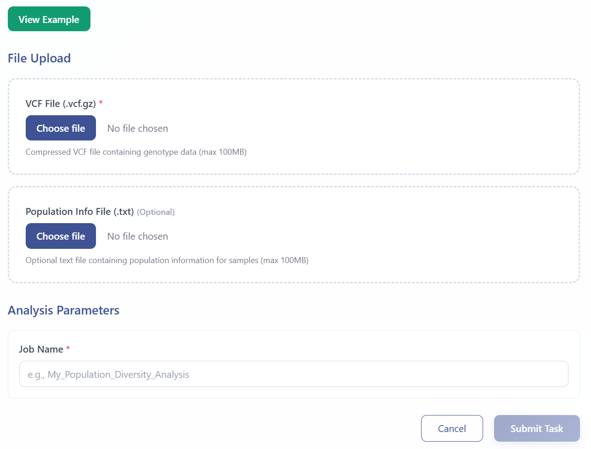
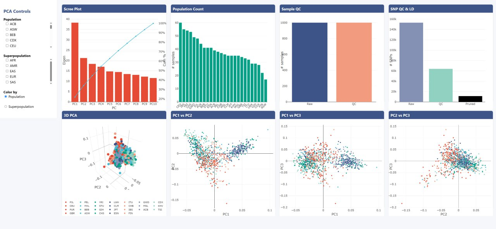
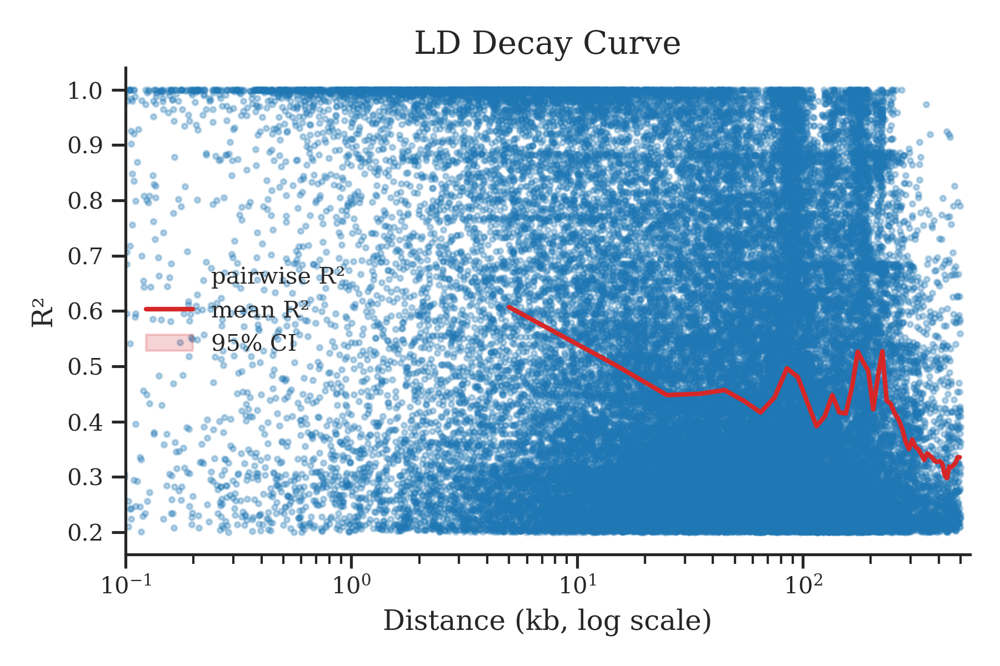
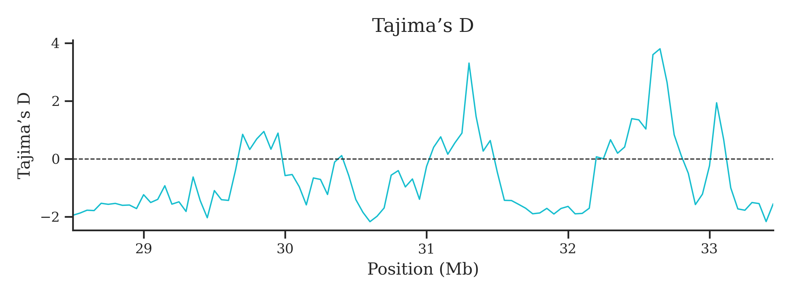
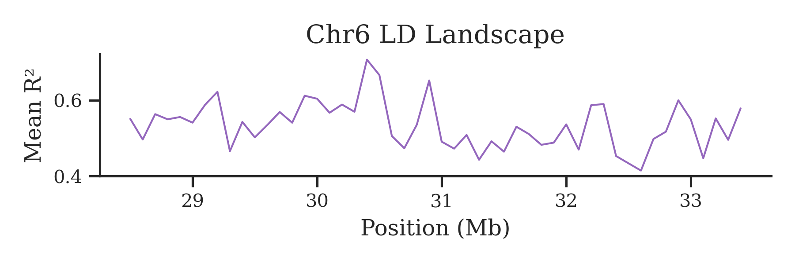
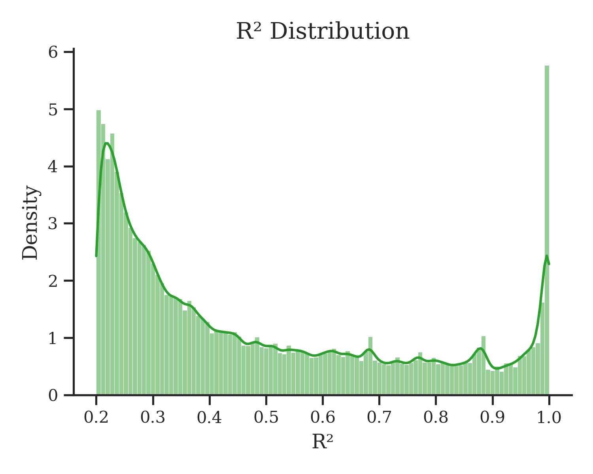
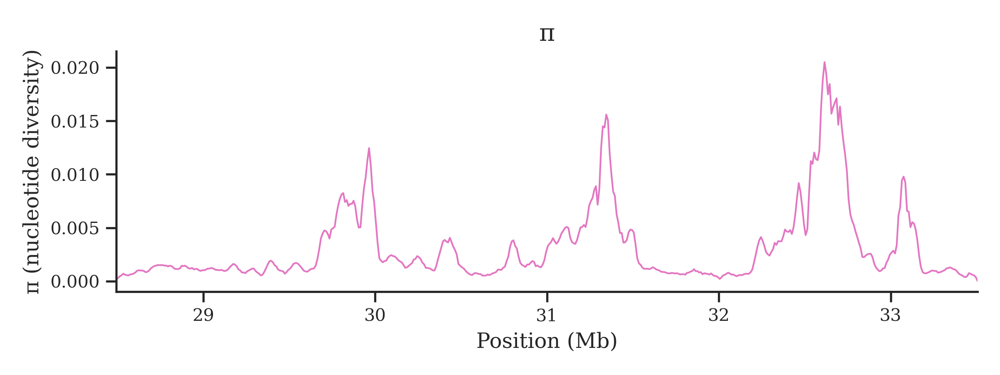

# HLA Population Diversity Analysis

Population genetic analyses of the MHC provide insights into its evolutionary dynamics, population structure, and selection pressures. In EAMHC, users can upload population-level VCF files for investigation. The platform utilizes **PLINK** to filter samples based on quality control metrics, prune loci in linkage disequilibrium (LD), and perform principal component analysis (PCA) to reveal substructure and reduce confounding. EAMHC also calculates genome-wide LD (r²), an indicator of co-segregation between loci, and employs **VCFtools** to compute Tajima's D and nucleotide diversity (π). Tajima's D detects deviations from neutrality (e.g., bottlenecks or selective sweeps), while π measures average pairwise diversity, reflecting evolutionary and demographic history. All outputs and visualizations—PCA plots, LD decay curves, Tajima's D and π tracks—are downloadable. Example input files and results are provided to guide users through the workflow.

---

## Workflow Steps

### 1. Launch Population Diversity Module  
Click **HLA Population Diversity Analysis** in the analysis menu to access the module.

### 2. Upload Data and Configure Analysis

- Enter sample/task metadata (Sample ID, Project Name)
- Upload **Population VCF file** (required): Contains variant data for your population samples
- Upload **Sample information file** (required): Contains population labels and sample metadata
- Click the green **View Example** button to access sample data and example results

  

Upon submission, you will receive a **temporary link** and a **Task ID** that can be used to query job status and retrieve results.

### 3. Query Job Status  
Visit **Workspace**:  
https://eamhc.deepomics.org/workspace  
Search by your Task ID or use the temporary link to view job status and results.  

  

### 4. Download Results  
- **PCA results** (interactive 2D/3D)  
  

    
  
  
- **Population genetic metrics** (LD decay, Tajima's D, π)  

    
  
  
  

    
  
  
  

    
  
  
  

    
  
  
  

    
  
  
- **Full results** (tables & figures)  
  

    
  

---

## References

1. Zhou F., Cao H., Zuo X., et al. Deep sequencing of the MHC region in the Chinese population contributes to studies of complex disease. *Nat. Genet.* 2016;48(7):740–746. https://doi.org/10.1038/ng.3576  
2. Purcell S., Neale B., Todd-Brown K., et al. PLINK: a tool set for whole-genome association and population-based linkage analyses. *Am. J. Hum. Genet.* 2007;81(3):559–575.  
3. Danecek P., Auton A., Abecasis G., et al. The variant call format and VCFtools. *Bioinformatics* 2011;27(15):2156–2158.  
4. Tajima F. Statistical method for testing the neutral mutation hypothesis by DNA polymorphism. *Genetics* 1989;123(3):585–595.  
5. Nei M. Molecular Evolutionary Genetics. Columbia University Press; 1987.