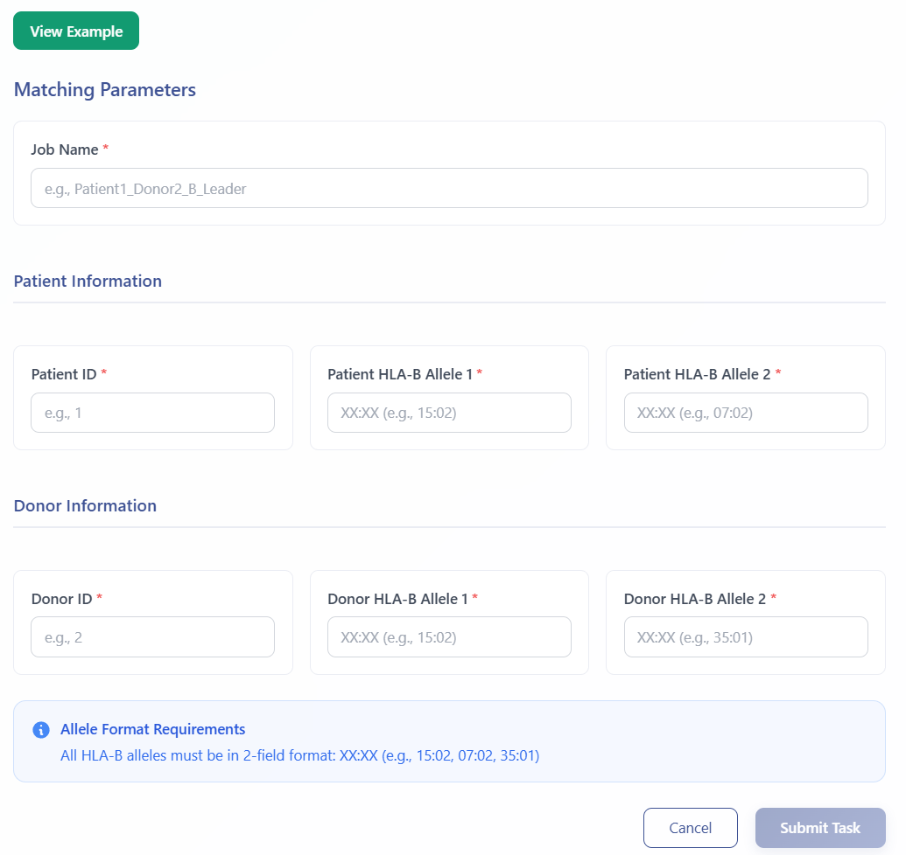
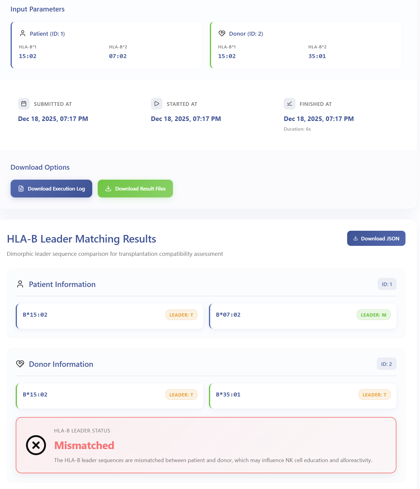

# HLA-B Leader Matching Module

The HLA-B Leader Matching module compares dimorphic HLA-B leader sequences between patient and donor to assess graft-versus-host disease risk in HLA-B mismatched transplantation settings. The leader peptide polymorphism (methionine vs. threonine at position -21) influences NK cell education and alloreactivity through differential binding to HLA-E, making this an important consideration in transplant donor selection.

---

## Workflow Steps

### 1. Launch HLA-B Leader Matching Module  
Click **HLA-B Leader Matching** in the analysis menu to access the module.

### 2. Enter HLA-B Typing Information

- Enter sample/task metadata (Sample ID, Project Name)
- Input **Patient HLA-B alleles** (required): Both alleles for the recipient
- Input **Donor HLA-B alleles** (required): Both alleles for the donor
- Click the green **View Example** button to access sample data and example results

  

Upon submission, you will receive a **temporary link** and a **Task ID** that can be used to query job status and retrieve results.

### 3. Query Job Status  
Visit **Workspace**:  
https://eamhc.deepomics.org/workspace  
Search by your Task ID or use the temporary link to view job status and results.

### 4. Download Results  
- **Leader sequence classification** (M/T dimorphism) and **match status**  
  

    
  

---

## References

1. Petersdorf E.W., Carrington M., O'hUigin C., et al. Role of HLA-B exon 1 in graft-versus-host disease after unrelated haemopoietic cell transplantation: a retrospective cohort study. *Lancet Haematol.* 2020;7(6):e423–e431.
2. Boudreau J.E., Hsu K.C. Natural killer cell education and the response to infection and cancer therapy: stay tuned. *Trends Immunol.* 2018;39(3):222–239.