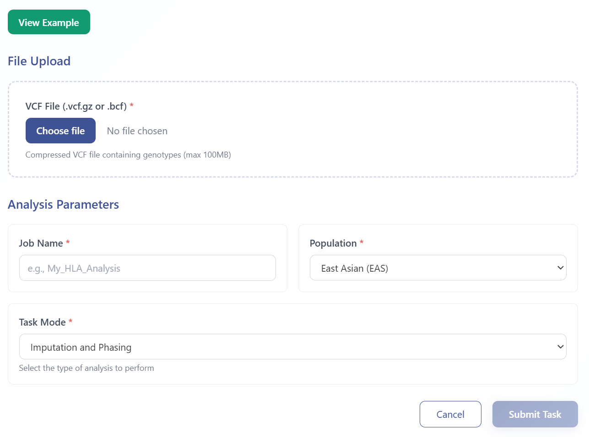
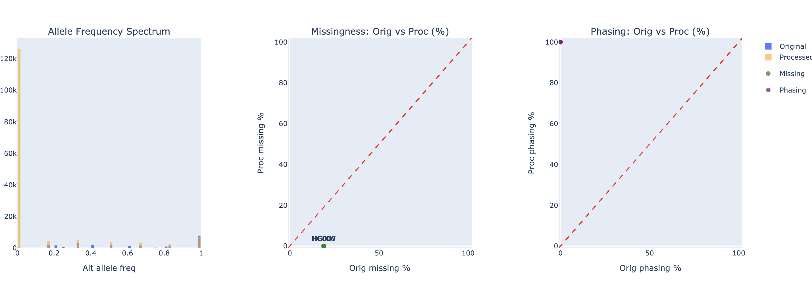

# Imputation & Phasing Module

Accurate HLA imputation and phasing play pivotal roles in population-based genetic studies, enabling the identification of fine-scale variation among diverse groups. A population-specific reference panel further enhances accuracy in genotype calling and phasing, particularly for East Asian populations, by tailoring the underlying assumptions to their unique haplotype structures. To accommodate diverse analytical needs, we offer three flexible modes:

1. **Imputation-only**  
   – Input: pre-phased VCF with missing MHC genotypes  
   – Tool: beagle5  

2. **Phasing-only**  
   – Input: complete sample genotypes in VCF  
   – Tools: SHAPEIT4, Eagle2, beagle5  

3. **Simultaneous Imputation & Phasing**  
   – Input: VCF with missing loci  
   – Pipeline: pre-phase with SHAPEIT4/Eagle2/beagle5 → impute with beagle5  

All three options include example input/output files and reports to guide users through the process.

---

## Workflow Steps

### 1. Launch Imputation & Phasing Module  
Click **Imputation & Phasing** in the analysis menu to access the module.

### 2. Upload Data and Select Analysis Mode

- Enter sample/task metadata (Sample ID, Project Name)
- Configure data processing parameters as needed
- Select analysis mode based on your requirements:
  - **Phasing Only**: For phasing complete sample genotypes
  - **Imputation Only**: For imputing missing genotypes in pre-phased data
  - **Phasing + Imputation**: For simultaneous phasing and imputation of data with missing loci
- Click the green **View Example** button to access sample data and example results

  

Upon submission, you will receive a **temporary link** and a **Task ID** that can be used to query job status and retrieve results.

### 3. Query Job Status  
Visit **Workspace**:  
https://eamhc.deepomics.org/workspace  
Search by your Task ID or use the temporary link to view job status and results.  

  

### 4. Download Results  
- **Sample Report** 

  

  
- **Imputed / Phased Results** in VCF and summary report  

  

---

## References

1. Zhou F., Cao H., Zuo X., et al. Deep sequencing of the MHC region in the Chinese population contributes to studies of complex disease. *Nat. Genet.* 2016;48(7):740–746. https://doi.org/10.1038/ng.3576  
2. Browning B.L., Browning S.R. Genotype imputation with millions of reference samples. *Am. J. Hum. Genet.* 2016;98(1):116–126.  
3. Loh P.-R., Palamara P.F., Price A.L. Fast and accurate long-range phasing in a UK Biobank cohort. *Nat. Genet.* 2016;48(7):811–816.  
4. Delaneau O., Zagury J.-F., Marchini J. Improved whole-chromosome phasing for disease and population genetic studies. *Nat. Methods* 2013;10(1):5–6.