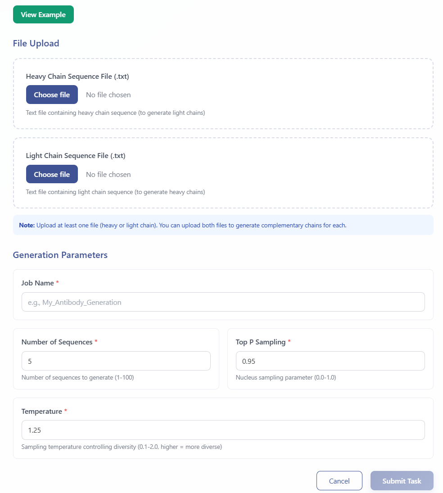
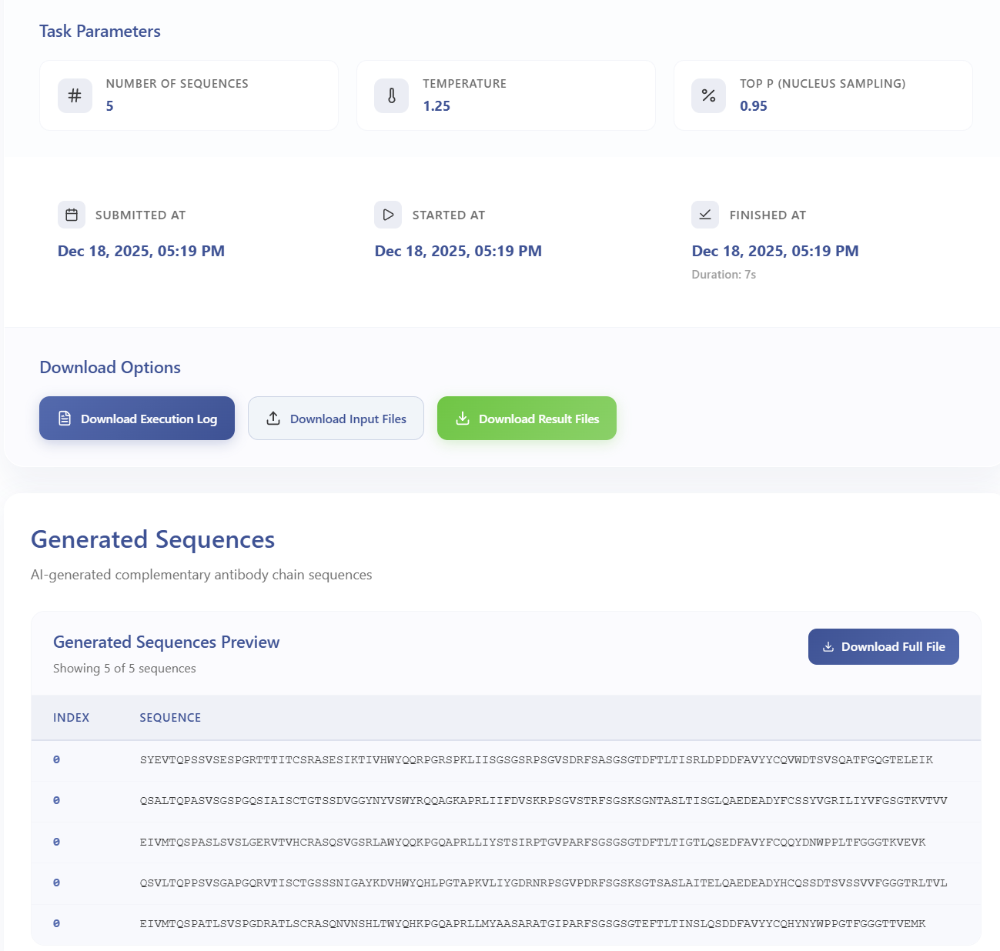

# Polymeric Immunoglobulin Generator Module

The Polymeric Immunoglobulin Generator is a generative language model for paired antibody sequence design trained on the Observed Antibody Space database. Given a heavy or light chain sequence as input, the model generates libraries of complementary chains, supporting antibody engineering, therapeutic antibody development, and humanization efforts.

---

## Workflow Steps

### 1. Launch Polymeric Ig Generator Module  
Click **Polymeric Ig Generator** in the analysis menu to access the module.

### 2. Upload Data and Configure Analysis

- Enter sample/task metadata (Sample ID, Project Name)
- Upload **Chain sequence file** (required): TXT file containing input heavy or light chain sequences
- Select **Input chain type**: Heavy or Light
- Set **Number of sequences to generate** and **Sampling temperature**
- Click the green **View Example** button to access sample data and example results

  

Upon submission, you will receive a **temporary link** and a **Task ID** that can be used to query job status and retrieve results.

### 3. Query Job Status  
Visit **Workspace**:  
https://eamhc.deepomics.org/workspace  
Search by your Task ID or use the temporary link to view job status and results.

### 4. Download Results  
- **Generated complementary chain sequences**  
  

    
  

---

## References

1. Melnyk I., Chenthamarakshan V., Chen P.-Y., et al. Reprogramming Pretrained Language Models for Antibody Sequence Infilling. *arXiv* 2022. https://doi.org/10.48550/arXiv.2210.07144