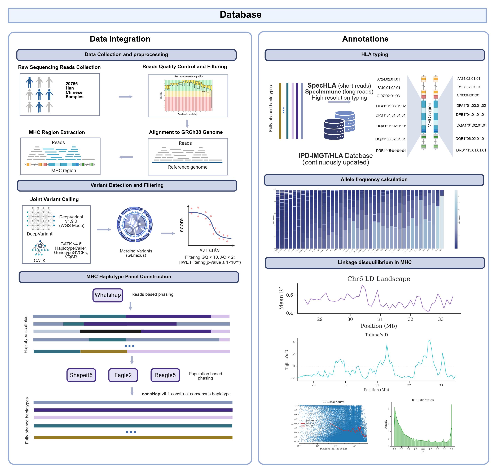
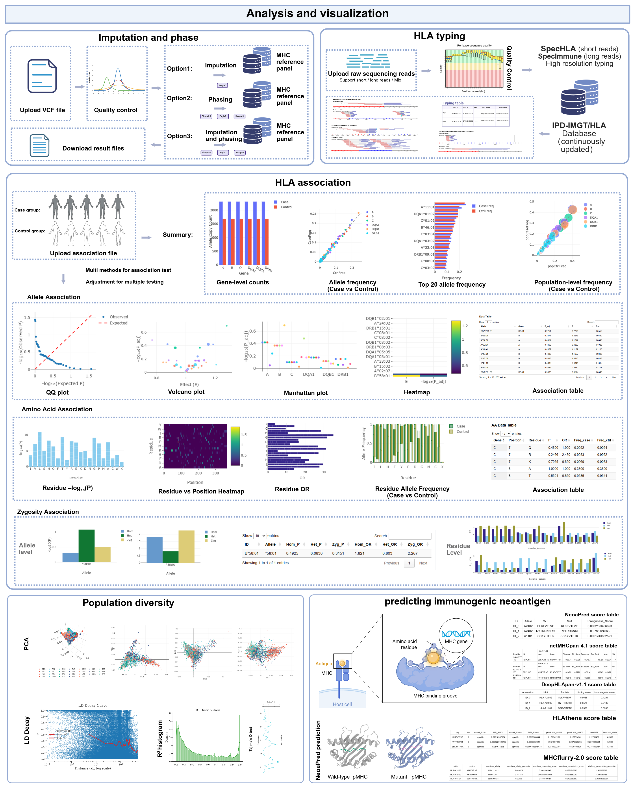

# Welcome to EAMHC Database

[EAMHC Database](https://eamhc.deepomics.org/)  is a comprehensive, web-based platform designed for high-resolution immunogenomic analysis of the Major Histocompatibility Complex in East Asian populations. It is anchored by a bespoke reference panel of **41 270** phased haplotypes derived from deep sequencing **20 635** individuals, which substantially improves phasing and imputation accuracy. EAMHC integrates 1. high-resolution HLA typing, 2. population-optimized haplotype phasing and genotype imputation, 3. MHC association analysis, 4. population genetic exploration, and 5. neoantigen binding prediction, each delivering interactive, publication-quality visualizations and comprehensive data-export capabilities to accelerate mechanistic discovery and precision-medicine applications in East Asian cohorts.

## Database

## Data Integration

We collected 20,635 samples from individuals of East Asian ancestry, encompassing **41,270 unique MHC haplotypes**, to construct a high‐resolution East Asian MHC reference panel. This resource is freely accessible on the EAMHC website, complete with links to all original data sources.  

On the site, you can explore:
- **Nucleotide Diversity**
- **Linkage Disequilibrium**
  - \(r^2\) metrics
  - LD decay curves
- **Population Structure**
  - Principal Component Analysis (PCA)

---

## Analysis and Visualization

EAMHC provides five unified, MHC‐focused analysis modules:

1. **Imputation & Phasing**  
   Accurate imputation and phasing tailored to East Asian samples.

2. **High-Resolution HLA Typing**  
   Up to 8-digit resolution from raw MHC sequencing data (supports short-read, long-read, or hybrid inputs).

3. **HLA Phenotype Association**  
   Allele- and amino-acid-level association tests, with zygosity assessment.

4. **Population Diversity Studies**  
   Quantify allele frequencies, heterozygosity, and other diversity metrics across East Asian populations.

5. **Immunogenic Neoantigen Prediction**  
   Predict putative neoantigens based on individual HLA genotypes and peptide binding affinities.

Explore each module interactively and visualize results in real time. Visit the [EAMHC website](#) to get started!

