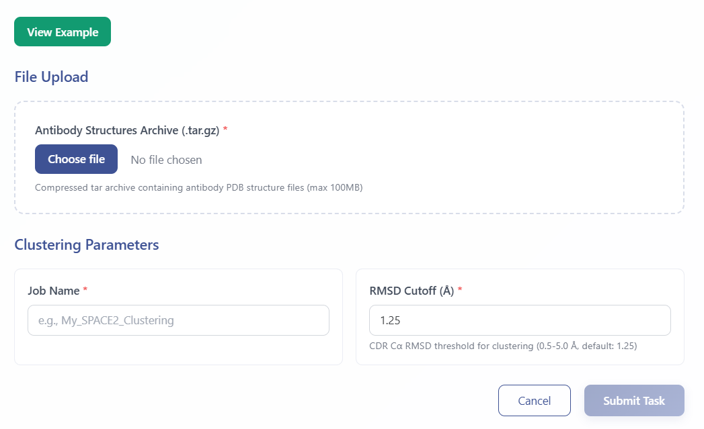
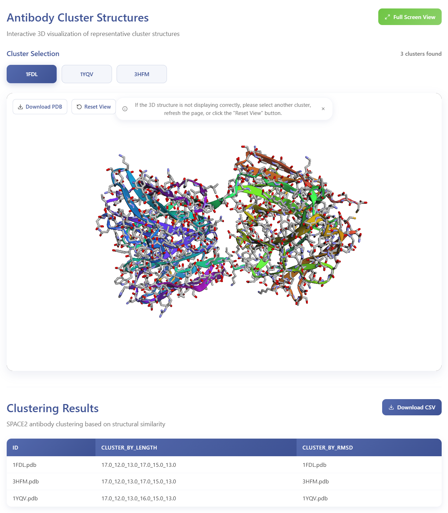

# SPACE2 Antibody Clustering Module

The SPACE2 Antibody Clustering module groups antibodies by structural similarity of CDR loops to identify clusters likely binding the same epitope. The algorithm performs rapid pairwise structural alignment of antibody models based on framework region superposition and CDR Cα RMSD calculation, enabling structural organization of antibody repertoires without requiring experimental structures.

---

## Workflow Steps

### 1. Launch SPACE2 Module  
Click **SPACE2 Antibody Clustering** in the analysis menu to access the module.

### 2. Upload Data and Configure Analysis

- Enter sample/task metadata (Sample ID, Project Name)
- Upload **Structure archive** (required): tar.gz file containing antibody PDB structures
- Set **Clustering threshold** (RMSD cutoff for grouping)
- Click the green **View Example** button to access sample data and example results

  

Upon submission, you will receive a **temporary link** and a **Task ID** that can be used to query job status and retrieve results.

### 3. Query Job Status  
Visit **Workspace**:  
https://eamhc.deepomics.org/workspace  
Search by your Task ID or use the temporary link to view job status and results.

### 4. Download Results  
- **Structural cluster assignments** with pairwise RMSD values  
  

    
  

---

## References

1. Raybould M.I.J., Marks C., Kovaltsuk A., et al. Public baseline and shared response structures for proteome-scale B-cell epitope prediction. *bioRxiv* 2022. https://doi.org/10.1101/2022.11.14.516404