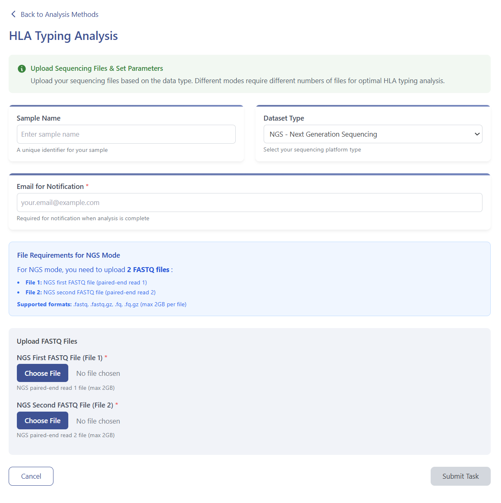

# HLA Typing Module

HLA typing is critical for organ transplantation, disease-association studies, and vaccine development because the major histocompatibility complex (MHC) exerts a central role in antigen recognition and immune response. High-resolution (8-digit) HLA typing is especially valuable as it captures subtle variations within the HLA locus, enabling more accurate predictions of disease risk and therapeutic outcomes.

We provide a highly user-friendly interface for HLA typing from raw sequencing data, built upon state-of-the-art tools (**SpecHLA** and **SpecImmune**). Users may upload next-generation short paired-end reads, third-generation long reads, or a combination of both. The platform performs automatic quality control and alignment, followed by high-resolution allele nomenclature based on the latest IPD-IMGT/HLA database. Because structural variation (SV) can alter HLA function, we annotate haplotype-level structural changes and incorporate unified SV calling results from multiple methods. We visualize SVs—including inversions, deletions, duplications, and complex breakpoints—using the **svviv2** engine. All results and visualizations are downloadable, and users receive progress updates by email. To further streamline the workflow, sample input and output files are provided for reference, facilitating easier adoption and consistent interpretation of results.

---

## Workflow Steps

### 1. Launch HLA Typing Module  
Click **HLA Typing** in the analysis menu, then **Start**.  

  

### 2. Upload Data  
- Enter sample/task metadata (Sample ID, Project Name).  
- Select data format: **NGS**, **TGS**, or **Mix**.  

  

  
- View sample input & output files and example reports (NGS/TGS/Mix) at:  
  https://eamhc.deepomics.org/database  

  

  
- Upon submission, you’ll receive email notifications for job start, progress, completion, or failure.

### 3. Query Job Status  
Visit **Workspace**:  
https://eamhc.deepomics.org/workspace  
Search by your registered email to view all jobs.  

  

### 4. Download Results  
- **Allele Report** table (each allele links to IPD-IMGT/HLA for full annotation):  
  https://www.ebi.ac.uk/ipd/imgt/hla/  

  

  
- **Structural Variation** visualization per haplotype:  

  

---

## References

1. Barker D.J., Maccari G., Georgiou X., Cooper M.A., Flicek P., Robinson J., Marsh S.G.E. The IPD-IMGT/HLA Database. *Nucleic Acids Res.* 2023;51:D1053–D1060.  
2. Zhou F., Cao H., Zuo X., Zhang T., Zhang X., Liu X., et al. Deep sequencing of the MHC region in the Chinese population contributes to studies of complex disease. *Nat. Genet.* 2016;48(7):740–746. https://doi.org/10.1038/ng.3576